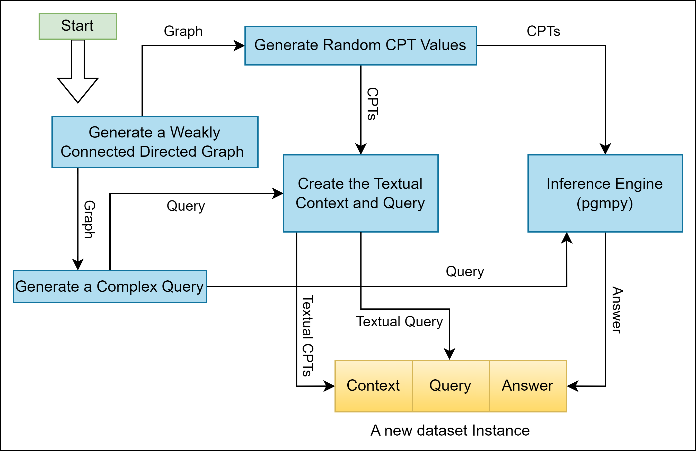
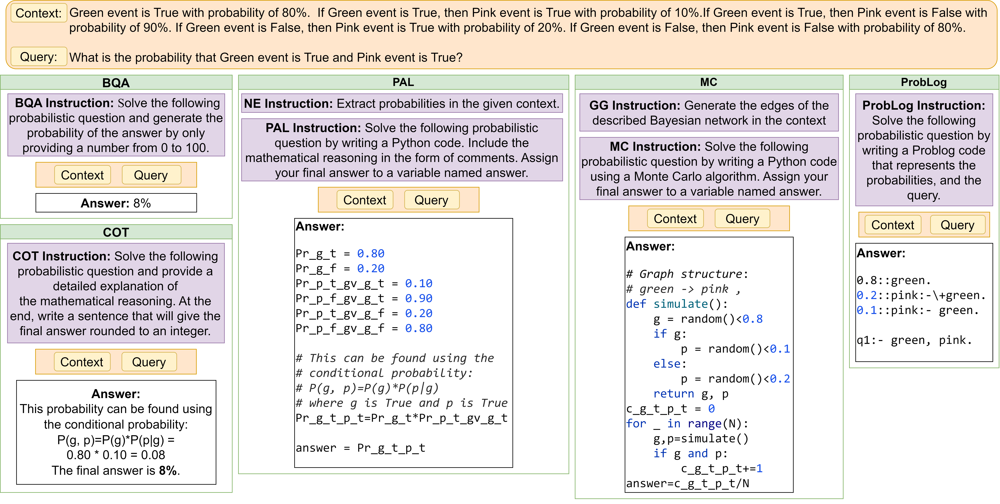

# Reasoning over Uncertain Text by Generative Large Language Models (AAAI 2025)

This repository is dedicated to the research and findings presented in the paper ["Reasoning over Uncertain Text by Generative Large Language Models."](https://arxiv.org/abs/2402.09614) Our study introduces the Bayesian Linguistic Inference Dataset (BLInD) and delves into the capabilities and limitations of Large Language Models (LLMs) in executing probabilistic reasoning with explicitly quantified uncertainties.

## Dataset Overview

The BLInD dataset is crafted to evaluate the probabilistic reasoning skills of LLMs, featuring:
- A foundational Bayesian Network for each instance.
- A textual description detailing the structure of the Bayesian Network.
- Probabilistic queries posed in natural language.
- Precise answers corresponding to these queries.


This dataset is produced through a systematic pipeline (shown in the Figure above) that constructs Bayesian Networks, populates Conditional Probability Tables (CPTs), formulates queries, and translates all components into natural language. The dataset files and the Python scripts used for generation are available in the [datasets directory](./datasets/).

## Methodological Approaches


Examples of methods are shown in the Figure. Each method forms a prompt that starts with an instruction (purple boxes) that describes the problem and the solution format. Then, the context and query and answer that solves the query based on the context are demonstrated (based on our first in-context example) to the LLM. If NE or GG subtasks are used with the method, their instruction and answers are appended, as shown in the PAL method for NE and the MC method for GG.

Use the following links to access the Python code to execute and test these methods:

1. **Baselines**:
   - [Basic Question Answering (BQA)](./BQAandCOT/)
   - [Chain of Thought (COT)](./BQAandCOT/)
2. **Subtasks**:
   - [Number Extraction (NE)](./NE/)
   - [Graph Generation (GG)](./GG/)
3. **Symbolic Methods**:
   - [Python code (PAL - Program Aided Language Models)](./PALandMC/)
   - [Monte Carlo algorithms (MC)](./PALandMC/)
   - [ProbLog](./Problog/)


## Repository Structure

- `datasets/`: Hosts the BLInD dataset and the Python scripts for its creation.
- `BQAandCOT/`: Contains scripts for testing BLInD with BQA and COT methodologies.
- `PALandMC/`: Includes scripts for employing PAL and MC techniques on BLInD.
- `Problog/`: Features scripts for applying ProbLog on BLInD.
- `NE/`: Provides scripts for the Number Extraction subtask.
- `GG/`: Offers scripts for the Graph Generation subtask.

## Dependencies

Ensure you have Python 3.10.6 or newer installed. To install the required Python packages, run the following commands in your terminal:

```bash
python -m pip install --upgrade pip
pip install -r requirements.txt
```

## Citation

To cite our work, please use the following BibTeX entry:

```bibtex
@article{
Nafar_Venable_Kordjamshidi_2025,
title={Reasoning over Uncertain Text by Generative Large Language Models},
volume={39},
url={https://ojs.aaai.org/index.php/AAAI/article/view/34674},
DOI={10.1609/aaai.v39i23.34674},
abstractNote={This paper considers the challenges Large Language Models (LLMs) face when reasoning over text that includes information involving uncertainty explicitly quantified via probability values. This type of reasoning is relevant to a variety of contexts ranging from everyday conversations to medical decision-making. Despite improvements in the mathematical reasoning capabilities of LLMs, they still exhibit significant difficulties when it comes to probabilistic reasoning. To deal with this problem, we introduce the Bayesian Linguistic Inference Dataset (BLInD), a new dataset specifically designed to test the probabilistic reasoning capabilities of LLMs. We use BLInD to find out the limitations of LLMs for tasks involving probabilistic reasoning. In addition, we present several prompting strategies that map the problem to different formal representations, including Python code, probabilistic algorithms, and probabilistic logical programming. We conclude by providing an evaluation of our methods on BLInD and an adaptation of a causal reasoning question-answering dataset. Our empirical results highlight the effectiveness of our proposed strategies for multiple LLMs.},
number={23},
journal={Proceedings of the AAAI Conference on Artificial Intelligence},
author={Nafar, Aliakbar and Venable, Kristen Brent and Kordjamshidi, Parisa},
year={2025},
month={Apr.},
pages={24911-24920}
}
